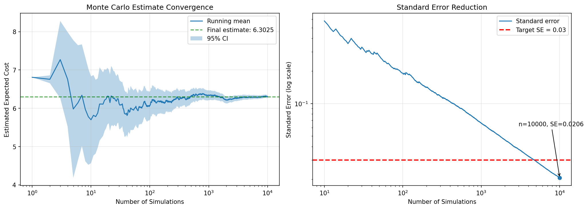
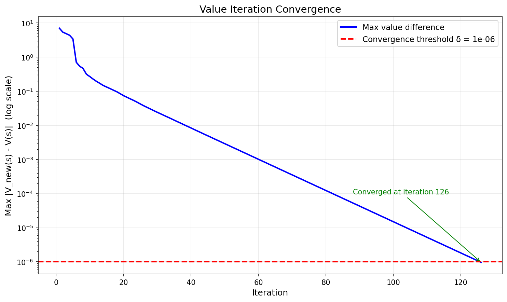

# Optimal Decision Making & Reinforcement Learning – Assignment 1

This project models a maintenance system as a Markov Decision Process (MDP) and solves it using value iteration.

---

## Problem

Two machines degrade over time due to stochastic wear.
The goal is to minimize the long-term discounted maintenance cost by choosing optimal actions.

---

## Methods

* MDP formulation ⟨S, A, P, R, γ⟩
* Bellman optimality equations
* Value Iteration (exact solution)
* Monte Carlo simulation (validation)

---

## Results

* Corrective-only policy cost: **6.326**
* Optimal policy cost: **3.219**
* Cost reduction: **~49%**

The optimal policy significantly reduces cost by performing preventive maintenance before failures occur.

---

## Report

[📄 View Full Report](ORL_Assignment_1.pdf)

---

## Visual Results

### Monte Carlo Convergence



### Value Iteration Convergence



---

## Code

The implementation includes:

* MDP model definition
* Transition dynamics and cost structure
* Value iteration algorithm
* Monte Carlo simulation for policy evaluation

---

## How to Run

```bash
python main.py
```

---

## Key Insight

Reactive maintenance leads to high costs due to failures and repair delays.
Preventive maintenance reduces total cost by nearly **50%**, making early intervention optimal.

---

## Tech Stack

* Python
* NumPy
* Matplotlib

---

## Author

Triantafyllos Fotoglou
TU/e – Data Science & AI
